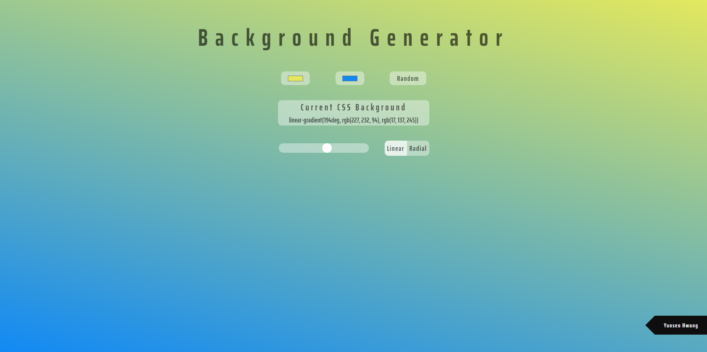

# Background Generator

This website shows a gradient background by selecting two colors. It then generates a copyable CSS code. Two colors can also be chosen randomly.

I used HTML, SCSS, Vanila JavaScript and [clipboard.js](https://clipboardjs.com/) library.

[→ Go to this site](https://background-generator-ashen.vercel.app/)

